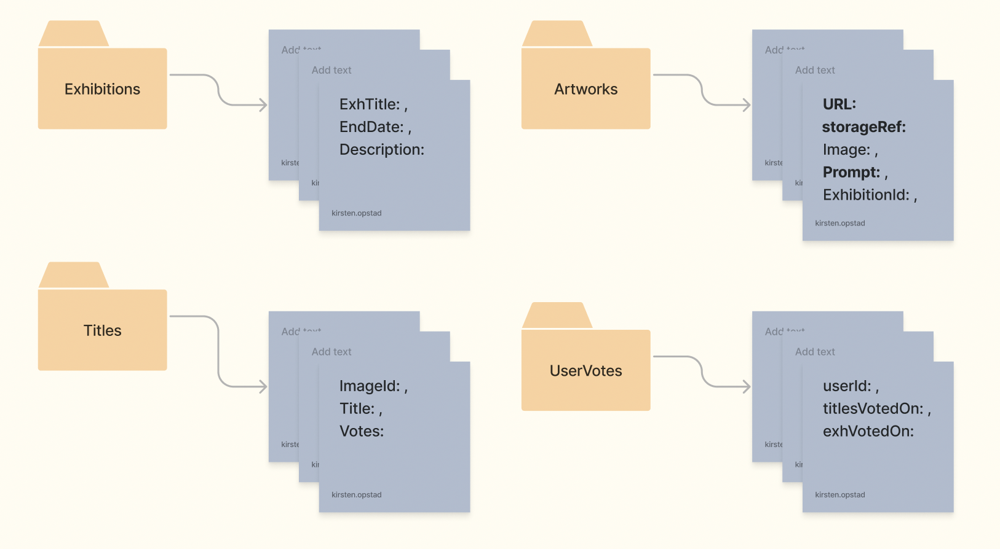

# [MoFA: the Museum of Fake Art](https://museum-of-fake-art.web.app)

#### By Kirsten Opstad

#### A web app that exhibits AI-generated artwork
***

<i>Fake art, generated from the prompt: "a poker game of fish, Lyonel Feininger eqsue"</i>
*** 
## Description

Recreate the user experience of visiting an art musuem website with completely AI-generated artwork. By presenting AI-generated artwork in a format typically reserved for fine (real) art, the application intends to provoke conversation around the following questions: 
* what makes art "real" or "fake"?
* is it possible to have a "real" human experiences with "fake" art?
* what are the social / cultural / human implications of the development of generative AI?
*** 
## Technologies Used

* JavaScript
* React
* Firebase
* webpack
* Node.js
* Axios
* Bootstrap
* HTML
* CSS

***
### __Objectives__ (MVP)

The application should have the following functionality:

__User stories:__
* ✅ Users can view exhibition of AI-generated artwork as a gallery or individually
* ✅ Users can add title/comment to AI-generated artwork
* ✅ Users can  upvote/downvote titles/comments of AI-generated artwork

### __Further Exploration__ (Stretch Goals)

__User stories:__
* ✅ Users can register and login
* ✅ Users may only vote once per AI-generated artwork

***
## Process 

### __Research & Planning__


__Initial Component Diagram__
[](https://www.figma.com/file/qwZdK8mH6mivu1HjC5udke/MOFA?node-id=0%3A1&t=DYXHI0F3lA0hwwPY-1)

__Basic Wireframe by Component__


__Data Organization__


__Hierarchical Component Drawing__


__Design Research__
[]((https://www.figma.com/file/qwZdK8mH6mivu1HjC5udke/MOFA?node-id=0%3A1&t=DYXHI0F3lA0hwwPY-1))

<!-- ### __Big Picture__
 -->

### __Implementation__
1. ✅ Create component drawing
2. ✅ Establish Component Hierarchy
    <!-- * App.js
      * Header.js
      * PlanVisit.js
      * ExhControl.js 
        * ExhList.js - displays all art in all exhibitions
          * Exhibit.js
        * ExhDetail.js - displays all art in one exhibition
          * Artwork.js
        * ArtworkDetail.js 
      * Footer.js -->
3. ✅ Build Static Components
4. ✅ Add State
5. ✅ Add Firebase to store data
6. ✅ Add Authentication
7. ✅ Add Authorization (title / vote)
8. ✅ Style to match mockup

<!-- [x] Screenshots

 -->

<!-- [Link to operational site](http://www.kirstenopstad.github.com/<REPOSITORY NAME>) -->
***
### __Goals__
1. ✅ Meet MVP (Minimum Viable Product)
2. ✅ Implement at least one stretch goal
3. ✅ Create thorough documentation of process

### __Stretch Goals__
1. Style front end to match design norms for reference museums 
2. ✅ Handle user login & registration
    * ✅ Add functionality so users may only vote once per work
3.  ✅ Ensure responsive design functionality across devices
4. 📌 Gather user feedback
5. Incorporate user feedback
6. ✅ Publish hosted site
7. Implement CI/CD (continuous integration and continuous delivery) with github Actions
8. Create functionality automatically generate new prompts for DALLE•2
9. ✅ Use app to call DALL•E API
10. 📌 Use Firebase to save .png from URL and store in Google cloud

***
 
### __Research, Planning & Implementation Log__

__Summary__
|Date |Hours  | Note|
--- | --- | ---|
|2/17|8 hrs| Project planning, research and basic component creation|
|2/24|8 hrs| Add conditional rendering, state, seeded data, Firebase & basic styling w/Bootstrap |
|2/25|5 hrs| Add voting, authentication & authorization for add title + vote |
|3/3|8 hrs| Add basic styling for exh components & add Firebase storage functionality |
|3/5|8 hrs| Try CORS workaround w. proxy, add funct. user can only vote once per title, style login as modal |
|3/7|8 hrs| Troubleshoot and research CORS issue |
|3/8|8 hrs| Add routes, content, and styling for static pages |
|3/9|2 hrs| Update documentation for pitch |
| |55 hrs| __Total To-Date__|
<!-- |date|hour|data13| -->

__Time Log__
|Date |Time  | Note|
--- | --- | ---|
|2/17|8:32a | Setup documentation boilerplate (README.md & capstone-proposal)|
|2/17|9:03a| Reasearch art musuem design features, start [whiteboard](https://www.figma.com/file/qwZdK8mH6mivu1HjC5udke/MOFA?node-id=3%3A298&t=OPUkQpOJpVfySjyu-0) to brainstorm|
|2/17|9:32a| Brainstorm "must dos" and "would love to dos" on [whiteboard](https://www.figma.com/file/qwZdK8mH6mivu1HjC5udke/MOFA?node-id=3%3A298&t=OPUkQpOJpVfySjyu-0)|
|2/17|10:01a| Add basic component diagram to README, sketch out initial API structure on whiteboard |
|2/17|10:36a| Listen to "How to Look at Art" & add sources section to README |
|2/17|11:18a| Add project MVP to capstone proposal, research tech for MVP & Stretch Goals|
|2/17|11:50a| Complete capstone proposal |
|2/17|1:31p| Update component diagram to reflect stretch goals|
|2/17|2:06p| Add create-react-app boilerplate & file structure|
|2/17|3:01p| Create wireframe to better understand component hierarchy |
|2/17|4:15p| Add functional components and seedData |
|2/17|4:39p| Setup basic plumbing for redux store |
|2/17|5:05p| Working on piping seedData to functional components using store |
|2/24|8:05a| Update README to reflect big picture, roadmap and revised data organization |
|2/24|9:00a| Refactor seedData to match new data org and update ExhList components |
|2/24|9:23a| __Important:__ DALLE•2 doesn't persist data, need to solve img storage |
|2/24|10:08a| Regen and import img files to exhSeedData |
|2/24|11:30a| Route data to ExhList & ExhDetail components + disp mostPopVote func |
|2/24|11:47a| Populate all ExhControl components with seedData |
|2/24|1:39p| Add conditional rendering to ExhControl |
|2/24|2:09p| Add bootstrap and basic styling |
|2/24|3:03p| Work in progress: add Firebase/Firestore on feature branch |
|2/24|4:16p| Successfully link firebase to project |
|2/24|4:51p| Add user comment & store in firebase |
|2/25|10:45a| Update roadmap & tagline in README |
|2/25|11:43a| Add user upVote & downVote title functionality |
|2/25|2:40p| Update component diagram and wireframe for authentication |
|2/25|3:40p| Add user registration, login & log out functionality |
|2/25|4:52p| Add conditional rendering to LoginControl, add authorization to title/vote functionality |
|2/25|5:00p| __Meets MVP Reqiurements__|
|3/3|9:43a| Add basic styling to exhibition components to match wireframe mock up |
|3/3|12:15p| Work in progress: upload file to db from URL |
|3/3|3:27p| Add functionality to add image to database from API-generated URL |
|3/3|4:39p| __Important:__ OpenAI does not allow CORS |
|3/5|9:30a| OpenAI API doesn't provide a built-in CORS solution|
|3/5|12:20p| Attempt downloading images by proxy fails, shift focus to priority features |
|3/5|2:02p| Firebase will coerce array data to number (size of array) without .arrayUnion method|
|3/5|3:00p| Add functionality user can only vote once per title |
|3/5|4:52p| Add modal styling to login/out feat. to hold users' place while logging in |
|3/6|8:30a| Add mkcert to make https://local... match OpenAI image URL |
|3/6|10:20a| GET call to OpenAI url from Postman is successful, researching setting up proxy|
|3/7|10:20a| Continue researching setting up proxy|
|3/7|4:45p| Multiple attempts at proxying & splitting double API call unsuccesful |
|3/8|10:16a| Add routes for static pages|
|3/8|11:00a| Add content to Visit and Store|
|3/8|12:00p| Add content to Membership and About|
|3/8|2:00p| Add content to FAQs and Subscribe|
|3/8|3:45p| Style static pages for consistency|
|3/8|5:00p| Make sign in modal avail sitewide |
|3/8|8:30p| Deploy site & send to small user group to test |
|3/9|10:31a| Update process images, links & organization of documentation |
<!-- |date|time|data13| -->

*** 

### Next Steps
1. Add functionality to Subscribe, Membership and Store buttons
2. Experiement with base64 response from OpenAI
2. Add Prodigi integration

### Project Links
* [Whiteboard](https://www.figma.com/file/qwZdK8mH6mivu1HjC5udke/MOFA?node-id=3%3A298&t=OPUkQpOJpVfySjyu-0) – Figma document where visual brainstorming for MoFA happens
* [Google Drive](https://drive.google.com/drive/folders/1rxBeCx7N13FGsMKBLVsTgdofXTlSvd4D?usp=sharing) – where design research images live 
* [Live Site](https://museum-of-fake-art.web.app/faq) – visit, login & add a title of your own!

***

## Sources
### __Subject Matter__
* [NPR Life Kit: How to Look at Art](https://www.npr.org/2023/01/05/1147239071/dont-get-art-you-might-be-looking-at-it-wrong)
### __Design Research__
* [LACMA](https://www.lacma.org/)
* [MassMOCA](https://massmoca.org/)
* [Guggenheim](https://www.guggenheim.org/)
### __Technology__
* [Open AI DALL•E 2](https://openai.com/dall-e-2/)

***
## Setup/Installation Requirements

* Clone this repo to your workspace.
* Navigate to the top level of the directory.
* In the root directory of the project, run this command to install all packages listed in the package.json:
```
$ npm install
```
* Then, to build and serve the project, run: 
```
$ npm run start
```
***

## Known Bugs

* No known bugs. If you find one, please email me at kirsten.opstad@gmail.com with the subject **[_Repo Name_] Bug** and include:
  * BUG: _A brief description of the bug_
  * FIX: _Suggestion for solution (if you have one!)_
  * If you'd like to be credited, please also include your **_github user profile link_**

*** 

## License

MIT License

Copyright (c) 2023 Kirsten Opstad

Permission is hereby granted, free of charge, to any person obtaining a copy of this software and associated documentation files (the "Software"), to deal in the Software without restriction, including without limitation the rights to use, copy, modify, merge, publish, distribute, sublicense, and/or sell copies of the Software, and to permit persons to whom the Software is furnished to do so, subject to the following conditions:

The above copyright notice and this permission notice shall be included in all copies or substantial portions of the Software.

THE SOFTWARE IS PROVIDED "AS IS", WITHOUT WARRANTY OF ANY KIND, EXPRESS OR IMPLIED, INCLUDING BUT NOT LIMITED TO THE WARRANTIES OF MERCHANTABILITY, FITNESS FOR A PARTICULAR PURPOSE AND NONINFRINGEMENT. IN NO EVENT SHALL THE AUTHORS OR COPYRIGHT HOLDERS BE LIABLE FOR ANY CLAIM, DAMAGES OR OTHER LIABILITY, WHETHER IN AN ACTION OF CONTRACT, TORT OR OTHERWISE, ARISING FROM, OUT OF OR IN CONNECTION WITH THE SOFTWARE OR THE USE OR OTHER DEALINGS IN THE SOFTWARE.
